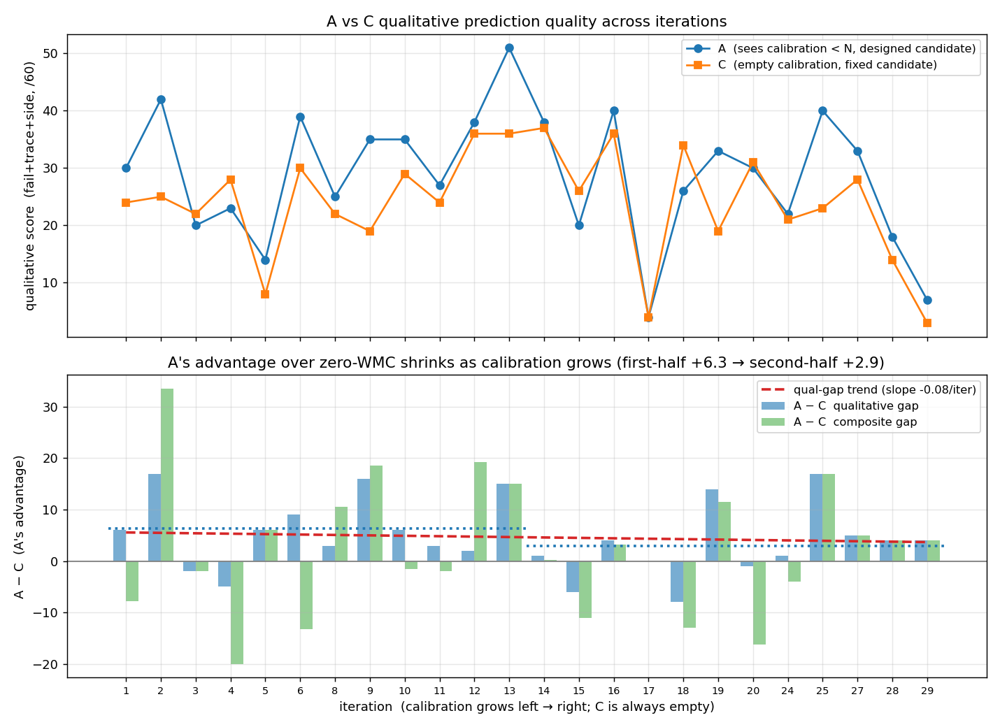

# 消融实验：WMC calibration 内容到底有没有预测价值？（A / C / B 三臂）

**日期**：2026-06-02
**作者**：Yuhan Chen (Ch1nyzzz)
**代码与原始产物**：`scripts/calib_value_test/`，机器生成结果见 `scripts/calib_value_test/out/REPORT.md` 与 `out/scores.json`

---

## 0. 一句话结论

把 proposer 累积的 `world_model_calibration.md` **整个抽空**（零 WMC，下称 **C** 臂），
它对下一轮 candidate 结果的**客观数值预测**和带全量 calibration 的 proposer **一样准**
（甚至略好）。calibration 文本作为"知识库"**没有可迁移的预测价值**——
主实验里 WMC 的端到端收益更可能来自 **predict-then-execute 这个纪律本身**，
而不是这份文件被复用。

---

## 1. 动机：为什么需要一条"完全看不到 WMC"的臂

最初的 calibration-value 测试只有两臂：

- **A**（历史）：proposer 当轮真实写下的 `prediction.md`，它当时只看得到 `iter < N` 的 calibration；
- **B**（反事实）：拿**最终完整 calibration 减去 iter N 自己那段**、并把 iter N 的结果**数字抹掉**，让一个全新 kimi 重新只做预测。

问题在于 **A 并不是"零 WMC"基线**：对任意 `N ≥ 2`，A 都看得到此前累积的 calibration，
只是比 B 少。唯一例外是 **iter 1 的 A**——此前没有任何 distill，它恰好等于零 WMC。
而在那个最干净的点上，零 WMC 的 A（composite 45）反而**高于**看到几乎全量 calibration 的
B（composite 33）。这促使我们补一条对所有 iter 都成立的、严格零知识的 **C 臂**。

---

## 2. 实验设计

对每个可观测 iteration N，用**同一个固定 candidate**、**同一个真实结果**、**同一套盲评 rubric**，
比较三种预测：

| 臂 | 看到的 calibration | candidate 来源 | 是否带 hindsight |
|---|---|---|---|
| **A**（历史） | 只有 `iter < N` | **自己设计的** | 无（只看过去） |
| **B**（反事实） | 最终完整 calibration **减 iter N**、数字抹掉 | 固定（别人给的） | **有**（残留 distill 仍定性引用 iter N） |
| **C**（零 WMC 基线） | **空**——只有任务说明 preamble，**零 distill** | 固定（别人给的） | **无**（什么都没看到） |

两组对比各自隔离不同的变量：

- **C vs B —— 最干净的"calibration 内容"隔离**：两臂都预测一个自己没设计的固定 candidate，
  唯一变量就是 calibration 空 vs 满。其中 **passrate 维度是 B 唯一无法靠 hindsight 取巧的维度**
  （iter N 的数字已被抹掉），所以这个维度上打平，就意味着累积内容没有可迁移的数值预测价值。
- **C vs A —— 端到端 gap（有混淆）**：A 额外带着"自己设计了 candidate、更懂它的 failure mode"
  这个优势，所以 C vs A 读作端到端差距，**不是**干净的 calibration-content 效应。

### 评分（composite 0–100）

| 维度 | 分值 | 怎么算 |
|---|---:|---|
| passrate-Δ | 40 | **确定性**（`score.py`）：覆盖 25（实际值落在预测区间内）+ 锐度 15（正确且区间越窄越高） |
| failure-type movement | 25 | 盲评 LLM 判官 vs `prev→actual` 的 failure-cluster delta |
| trace movement | 20 | 盲评 vs token delta + 原始 `candidate_results` |
| side-effects | 15 | 盲评：回归 / 风险判断是否命中 |

**只有 passrate 维度是确定性、三臂完全可比的**；其余三个定性维度由盲评判官打分。

---

## 3. 实现

全部在 `scripts/calib_value_test/`：

- `common.py` — `build_empty_calibration()`（C 的零知识 calibration = 仅 788 字符的任务 preamble）、
  `build_loo_calibration()`（B 的 leave-one-out + 数字抹除）、预测区间解析、failure-cluster 计算。
- `stage.py` — 每个 iter 同时物化 B、C 两个 scratch workspace（空/满 calibration + 固定 candidate + 预测-only prompt）。
- `rerun_b.py --condition {B,C}` — 忠实复刻原始 proposer 调用（kimi-k2.6 / docker），只换 calibration 内容。
- `score.py --emit-inputs / --aggregate` — 确定性 passrate 分 + 盲评输入 + 三臂聚合。

复现（已 source `.env`，带 `KIMI_API_KEY`）：

```bash
ITERS=1,2,3,4,5,6,8,9,10,11,12,13,14,15,16,17,18,19,20,24,25,27,28,29
python scripts/calib_value_test/stage.py --iters $ITERS
python scripts/calib_value_test/rerun_b.py --condition C --iters $ITERS --workers 4
python scripts/calib_value_test/score.py --iters $ITERS --emit-inputs
# 每个 out/iter_NNN/scorer_input_C.md 跑一个盲评 subagent → llm_score_C.json
python scripts/calib_value_test/score.py --iters $ITERS --aggregate
```

覆盖 LongMemEval-s WMC run 的 **24 个 iter**，C 臂 24/24 全部成功产出预测。

---

## 4. 结果

### 4.1 配对统计（Δ = 第一臂 − 第二臂）

| 对比 | 维度 | mean Δ | t | 胜/负/平 |
|---|---|---:|---:|:--:|
| **C − A** | **passrate（客观）** | **+2.25** | +1.27 | **12 / 4 / 8** |
| **C − A** | 定性（fail+trace+side） | −4.62 | −3.26 | 5 / 18 / 1 |
| **C − A** | composite | −2.38 | −0.93 | 10 / 13 / 1 |
| **C − B** | **passrate（客观）** | **−1.30** | −0.56 | **6 / 7 / 11** |
| **C − B** | 定性（fail+trace+side） | −4.54 | −2.72 | 7 / 16 / 1 |
| **C − B** | composite | −5.84 | −1.77 | 6 / 17 / 1 |

均值 composite：**A = 45.0，B = 48.5，C = 42.7**（/100）。
均值 passrate（/40）：**A = 16.3，C = 18.5**（C 在客观维度反而更高）。

### 4.2 逐 iter（A vs C）

| iter | actual | A pass | A tot | C pass | C tot | C−A |
|---|---|---|---|---|---|---|
| 1 | 0.38 | 15.0 | 45.0 | 28.8 | 52.8 | +7.8 |
| 2 | 0.47 | 34.0 | 76.0 | 17.5 | 42.5 | −33.5 |
| 3 | 0.27 | 0.0 | 20.0 | 0.0 | 22.0 | +2.0 |
| 4 | 0.49 | 5.0 | 28.0 | 20.0 | 48.0 | +20.0 |
| 5 | 0.39 | 0.0 | 14.0 | 0.0 | 8.0 | −6.0 |
| 6 | 0.50 | 12.5 | 51.5 | 34.8 | 64.8 | +13.2 |
| 8 | 0.53 | 20.0 | 45.0 | 12.5 | 34.5 | −10.5 |
| 9 | 0.54 | 17.5 | 52.5 | 15.0 | 34.0 | −18.5 |
| 10 | 0.53 | 12.5 | 47.5 | 20.0 | 49.0 | +1.5 |
| 11 | 0.47 | 2.5 | 29.5 | 7.5 | 31.5 | +2.0 |
| 12 | 0.57 | 34.8 | 72.8 | 17.5 | 53.5 | −19.2 |
| 13 | 0.63 | 35.5 | 86.5 | 35.5 | 71.5 | −15.0 |
| 14 | 0.66 | 37.0 | 75.0 | 37.8 | 74.8 | −0.2 |
| 15 | 0.66 | 17.5 | 37.5 | 22.5 | 48.5 | +11.0 |
| 16 | 0.69 | 37.0 | 77.0 | 37.8 | 73.8 | −3.2 |
| 17 | 0.17 | 0.0 | 4.0 | 0.0 | 4.0 | +0.0 |
| 18 | 0.64 | 7.5 | 33.5 | 12.5 | 46.5 | +13.0 |
| 19 | 0.61 | 2.5 | 35.5 | 5.0 | 24.0 | −11.5 |
| 20 | 0.69 | 22.5 | 52.5 | 37.8 | 68.8 | +16.2 |
| 24 | 0.62 | 2.5 | 24.5 | 7.5 | 28.5 | +4.0 |
| 25 | 0.69 | 22.5 | 62.5 | 22.5 | 45.5 | −17.0 |
| 27 | 0.71 | 37.8 | 70.8 | 37.8 | 65.8 | −5.0 |
| 28 | 0.68 | 15.0 | 33.0 | 15.0 | 29.0 | −4.0 |
| 29 | 0.11 | 0.0 | 7.0 | 0.0 | 3.0 | −4.0 |

---

## 5. 解读

### A vs C 单独不足以定论——它混入了 candidate-design 优势

C 的 composite 略低于 A（−2.38，t≈−0.93，不显著），但这个差距**全部来自定性维度**
（−4.62，t≈−3.26，显著）。而 A 在定性维度占优，主要不是因为它看了 calibration，而是因为
**A 是 candidate 的设计者**——它天然更了解自己这次改动的 failure mode / trace 走向。
一旦看**客观、不可作弊的 passrate 维度**，零 WMC 的 **C 反而略优**（+2.25，12 胜 4 负 8 平）。

### 真正干净的判据是 C vs B：客观维度打平

要剥掉 candidate-design 这个混淆，就看 **C vs B**（两臂都不设计 candidate）。
在 B **唯一无法靠 hindsight 取巧的 passrate 维度**上，C 与 B **统计打平**
（mean −1.30，t≈−0.56，**11 个平局**）。也就是说：把全量世界模型喂给 proposer，
并没有让它对下一轮的**数值结果**预测得更准。

B 在 composite 上的表面优势（B=48.5 最高），几乎全部来自**定性维度**
（C−B 定性 −4.54，显著），而那恰恰是 B 残留的"未来 distill"文本能定性剧透该 iter
failure mode 的地方——是 **hindsight，不是可迁移的世界模型能力**。

### Bottom line

两个干净视角——**C vs B 的内容隔离** 与 **C vs A 的客观 passrate 维度**——都指向同一结论：

> 累积的 `world_model_calibration.md` **没有可迁移的预测价值**：一个白板 proposer
> 预测 iteration 结果的准确度基本一样。这与主实验中 WMC 的端到端收益来自
> **predict-then-execute 纪律本身**（强制下注 + 对齐 mismatch），而非把 calibration
> 当作可复用知识库，是一致的。

---

## 5b. calibration 的"累积厚度"有没有带来增益？——看 A−C 随 iter 的趋势

这是检验 calibration 价值最直接的角度。calibration 是 **append-only、每轮变厚**的：
A 看到的世界模型越来越丰富，而 C 永远是空白。
**如果"累积的 calibration 知识"真的有用，A 相对 C 的优势就应该随 iter 增长。** 实测相反：



> 复现：`python scripts/calib_value_test/plot_trend.py`

| A − C（A 的优势） | 前 12 iter 均值 | 后 12 iter 均值 | 线性斜率 |
|---|---:|---:|---:|
| 定性 gap（fail+trace+side） | **+6.33** | **+2.92** | −0.08 / iter |
| 总分 gap（composite） | **+4.69** | **+0.06** | −0.05 / iter |

两个发现**并存**，都要诚实承认：

1. **A 整体确实略占优**（上图蓝线多数落在橙线之上；剔除两个崩溃 iter 17/29 后，定性 gap 均值
   +4.86）。这支持「**完整 WMC 工作流**（读 calibration + predict-then-execute + 基于它设计
   candidate）端到端优于零 WMC」——方向与主实验的 control vs WMC 一致。**这一层结论成立。**

2. **但这个优势随 iter 递减、而非递增**（趋势线斜率为负，后半几乎归零）。这恰好**反驳**了
   "增益来自累积 calibration 厚度"的假说——厚度一路在涨，gap 却一路在跌。更自洽的解释是：
   A 的优势来自一个**每轮恒定存在**的因素（candidate-design：自己设计的方案自己更懂），
   且早期 candidate 改动结构性强、设计者优势最明显；后期多为微调，连白板的 C 也能从 diff digest
   看懂大概，gap 自然收窄。

   关键稳健性：**系统性的 judge 批次偏差只会整体平移曲线、不会制造斜率**，所以"gap 随 iter
   下降"这个**趋势**结论比"定性绝对差值"更可信，不受 §6 caveat(3) 批次抖动的影响。

**小结**：A vs C 说明**端到端 WMC 机制**（含 predict-then-execute 与基于 calibration 的设计）
整体略有帮助；但"calibration 文本越积越厚 → 预测越来越准"这一条**没有被趋势支持**。
这与 C vs B 在客观维度打平相互印证：增益来自**机制/纪律**，而非把 calibration 当知识库越攒越值钱。

---

## 6. Caveats

1. **只有 B 带 hindsight**：B 的 LOO calibration 只抹了数字，残留 distill 仍定性引用 iter N；C 什么都没看到，是最干净的一臂。
2. **B、C 都不设计 candidate**，相对 A 有结构性劣势——所以 C vs A 的定性差距对 C 不利、需谨慎读。
3. **盲评批次**：A/B 的定性分来自原始判官批次，C 来自同一 rubric 的新批次，跨臂定性 delta 可能含轻微判官批次抖动；但 **passrate 维度是确定性的、三臂完全可比**，主结论建立其上。
4. **样本量**：n = 24，单 run（LongMemEval-s），单 proposer（kimi-k2.6）。

---

*相关：主实验报告见 [`REPORT.md`](REPORT.md)（control vs WMC 端到端）；本消融针对其中的 LongMemEval-s WMC run。*
